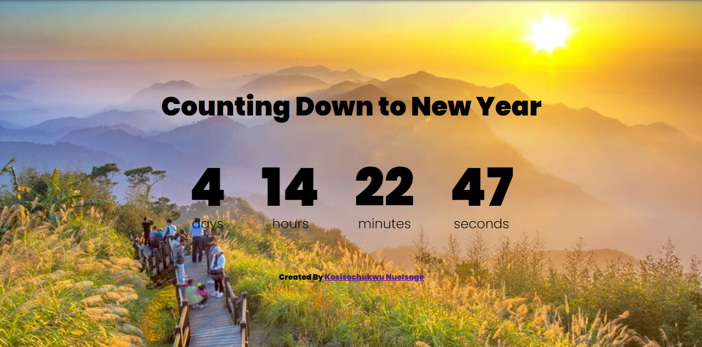

# Analog-clock

During my learning journey of html, css and javascript I decided to practice My skills on a simple new year countdown with time I'd make itn to loop at every year show. So this is it. You can make your suggestions too. Thank you

### Links

- Live Site URL: [here](https://sage-hex.github.io/new-year-countdown)

### Built with

- Semantic HTML5 markup
- CSS custom properties
- Flexbox
- Mobile-first workflow

## Author

- Website - [Kosisochukwu Emmanuel(Nuelsage)](https://www.twitter.com/nuel2sage)
- Frontend Mentor - [@sage-hex](https://www.frontendmentor.io/profile/sage-hex)
- Twitter - [@nuel2sage](https://www.twitter.com/nuelsage)